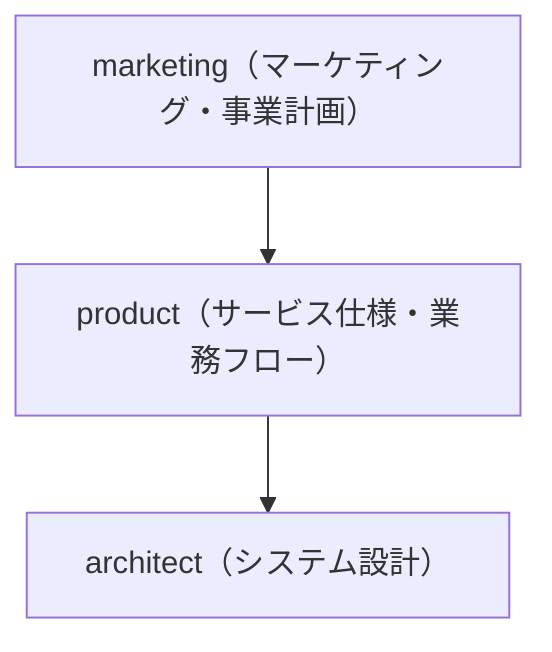

# プロジェクト概要

このプロジェクトは、「My Beer Log」というクラフトビール記録アプリを作ります。

# フォルダ構造

- docs/ # ドキュメント全体のルートディレクトリ
  - marketing/ # マーケティング・事業計画関連ドキュメント（最上位の依存・最初に策定）
    - roadmap.md # プロダクト全体のロードマップ
    - 0_lean_canvas.md # リーンキャンバス
    - 1_issues.md # 顧客課題・ペインポイント
    - 2_customer_segments.md # 顧客セグメント定義
    - 3_unique_value_proposition.md # 独自価値提案
    - 8_key_metrics.md # 主要 KPI・指標
    - 9_unfair_advantage_competitive_analysis.md # 競合優位性・競合分析
    - 9_unfair_advantage_market.md # 市場優位性・市場分析
  - product/ # サービス仕様・業務フロー等のプロダクト関連ドキュメント（marketing に依存）
    - features.md # 主要機能一覧・ロール別機能マトリクス
    - flow\_{role}.md # ロール毎のフロー
  - architect/ # システム設計関連ドキュメント（product に依存）
    - database.dbml # データベース設計（DBML 形式）

# ドキュメント依存関係（Mermaid）

# プロジェクト進行フロー

1. リーンキャンバスの記載（0_lean_canvas.md）
2. リーンキャンバスの詳細化（1_issues.md, 2_customer_segments.md, 3_unique_value_proposition.md, 8_key_metrics.md, 9_unfair_advantage_competitive_analysis.md, 9_unfair_advantage_market.md）
3. ロードマップ策定（roadmap.md）
4. 機能一覧策定（features.md）
5. ワークフロー策定（flow_actor.md, flow_pf_admin.md, flow_troupe_admin.md, flow_troupe_member.md）
6. 設計（database.dbml）

この順序でドキュメント・設計を進めてください。
