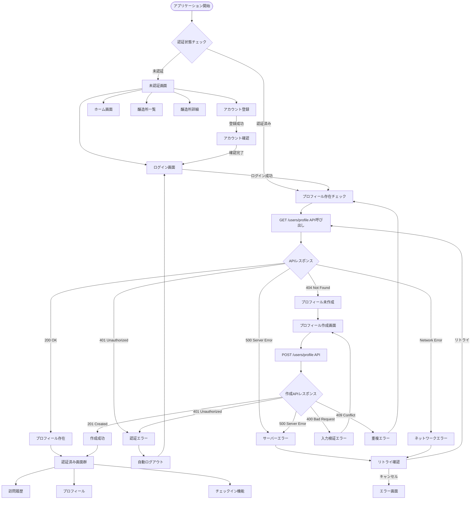
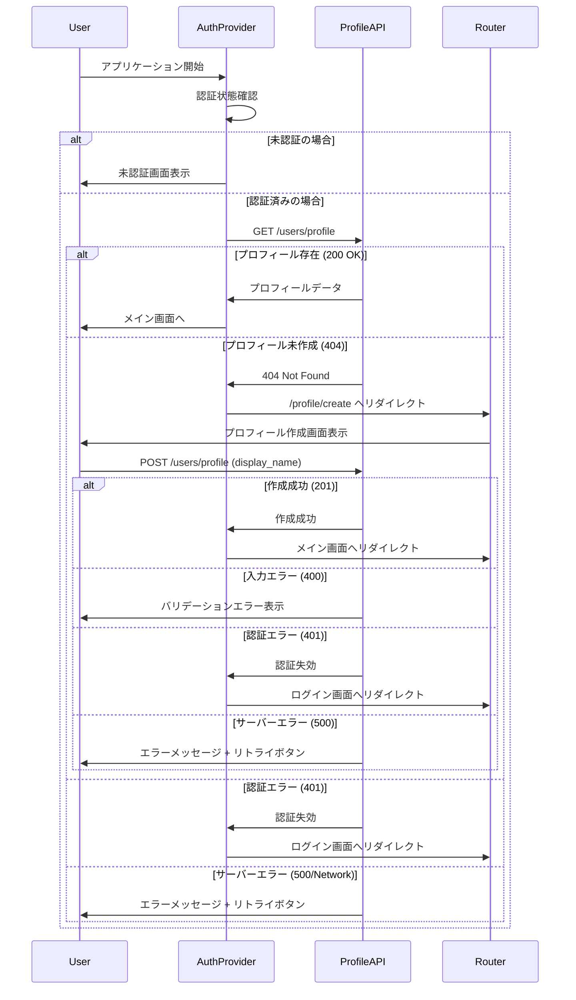

# My Beer Log - フロントエンド画面遷移設計書

## 概要

My Beer Log アプリケーションのフロントエンド画面遷移について、実装されたソースコードをベースに整理した設計書です。Next.js App Router を使用したクライアントサイドレンダリング（CSR）により構築されています。

## 画面一覧

### 認証系画面

| 画面名         | パス                   | コンポーネント      | 認証必要 | 説明                   |
| -------------- | ---------------------- | ------------------- | -------- | ---------------------- |
| ログイン       | `/auth/login`          | `LoginPage`         | ❌       | ユーザーのログイン     |
| アカウント登録 | `/auth/register`       | `RegisterPage`      | ❌       | 新規アカウント作成     |
| アカウント確認 | `/auth/confirm-signup` | `ConfirmSignupPage` | ❌       | Cognito 確認コード入力 |

### メイン画面

| 画面名 | パス | コンポーネント | 認証必要 | 説明                         |
| ------ | ---- | -------------- | -------- | ---------------------------- |
| ホーム | `/`  | `HomePage`     | ❌       | トップページ・ダッシュボード |

### 醸造所系画面

| 画面名     | パス              | コンポーネント        | 認証必要 | 説明                           |
| ---------- | ----------------- | --------------------- | -------- | ------------------------------ |
| 醸造所一覧 | `/brewery`        | `BreweryPage`         | ❌       | 全醸造所の検索・一覧表示       |
| 醸造所詳細 | `/brewery/[id]`   | `BreweryDetailPage`   | ❌       | 醸造所の詳細情報・チェックイン |
| 近隣醸造所 | `/brewery/nearby` | `NearbyBreweriesPage` | ❌       | GPS 位置情報による近隣検索     |

### ユーザー系画面

| 画面名           | パス              | コンポーネント        | 認証必要 | 説明                       |
| ---------------- | ----------------- | --------------------- | -------- | -------------------------- |
| 訪問履歴         | `/visits`         | `VisitsPage`          | ✅       | ユーザーのチェックイン履歴 |
| プロフィール     | `/profile`        | `ProfilePage`         | ✅       | ユーザー情報・統計・設定   |
| プロフィール作成 | `/profile/create` | `ProfileCreatePage`   | ✅       | 初回プロフィール作成       |

### 共通画面

| 画面名           | パス | コンポーネント     | 認証必要 | 説明                         |
| ---------------- | ---- | ------------------ | -------- | ---------------------------- |
| 404 エラー       | `*`  | `not-found.tsx`    | ❌       | ページが見つからない         |
| グローバルエラー | `*`  | `global-error.tsx` | ❌       | アプリケーション全体のエラー |
| ローディング     | `*`  | `loading.tsx`      | ❌       | 各画面のローディング状態     |

## 画面遷移フロー詳細

### 認証・プロフィールチェック統合フロー



### 実装ガイド用詳細フロー



## 包括的エラーハンドリング戦略

### HTTPステータスコード別処理方針

#### 認証関連エラー
- **401 Unauthorized**
  - 自動処理: セッション情報クリア → ログイン画面リダイレクト
  - ユーザー表示: "セッションが無効です。再度ログインしてください。"

#### プロフィール取得エラー
- **404 Not Found**
  - 自動処理: プロフィール作成画面 (`/profile/create`) へリダイレクト
  - ユーザー表示: "プロフィールを作成してください"

#### バリデーションエラー
- **400 Bad Request**
  - 自動処理: フォーム入力状態維持
  - ユーザー表示: 詳細なフィールド別エラーメッセージ
  - 復旧方法: 入力修正後に再送信

#### 重複・競合エラー
- **409 Conflict**
  - 自動処理: 最新状態の再取得
  - ユーザー表示: "データが更新されています。最新情報で再試行してください。"
  - 復旧方法: 自動リトライ（最大3回）

#### サーバーエラー
- **500 Internal Server Error**
  - 自動処理: 指数バックオフによる自動リトライ（1秒、2秒、4秒間隔）
  - ユーザー表示: "一時的な問題が発生しました。しばらくお待ちください。"
  - 手動復旧: リトライボタン表示

#### ネットワークエラー
- **Network Timeout/Connection Error**
  - 自動処理: 3回まで自動リトライ（2秒間隔）
  - ユーザー表示: "ネットワーク接続を確認してください。"
  - 手動復旧: リトライボタン + オフライン対応案内

### 自動復旧戦略

#### リトライ仕様
```typescript
interface RetryConfig {
  maxAttempts: number;
  baseDelay: number; // ミリ秒
  backoffMultiplier: number;
  retryableStatuses: number[];
}

const defaultRetryConfig: RetryConfig = {
  maxAttempts: 3,
  baseDelay: 1000,
  backoffMultiplier: 2,
  retryableStatuses: [500, 502, 503, 504, 408, 429]
};
```

#### リトライ対象判定
- **自動リトライ対象**: 500系エラー、ネットワークタイムアウト
- **手動リトライ対象**: 400系エラー（バリデーション除く）
- **リトライ非対象**: 401（認証）、400（バリデーション）、404（リソース不存在）

### 手動復旧オプション

#### リトライボタン機能
- エラー画面での明示的リトライ操作
- リトライ実行中のローディング状態表示
- リトライ失敗時の代替手段提示

#### フォールバック画面設計
- **軽量版機能**: サーバー依存機能の簡略版提供
- **オフライン対応**: ローカルストレージ活用の代替UI
- **問題報告**: サポート連絡手段の提供

#### ユーザーガイダンス
- **自己解決案内**: よくある問題と解決方法
- **代替アクション**: 同等機能への誘導
- **状況説明**: エラーの原因と復旧見込み時間

### エラー報告・監視機能

#### ユーザー向けエラー情報
- **エラーID**: 一意な問題識別子生成
- **発生時刻**: タイムスタンプ記録
- **操作コンテキスト**: エラー直前のユーザー操作

#### 開発者向けログ情報
- **スタックトレース**: エラー詳細情報
- **APIレスポンス**: サーバーからの完全なエラーレスポンス
- **環境情報**: ブラウザ、OS、ネットワーク状態

## 主要ユーザージャーニー

### 1. 新規ユーザー登録〜初回チェックイン

```
ホーム → アカウント登録 → アカウント確認 → ログイン → プロフィール作成 → ホーム → 近隣醸造所検索 → 醸造所詳細 → チェックイン
```

### 2. 既存ユーザーのログイン〜醸造所探索

```
ホーム → ログイン → ホーム → 醸造所一覧 → 検索・フィルター → 醸造所詳細 → チェックイン
```

### 3. 訪問履歴の確認(認証済み)

```
ホーム → 訪問履歴 → フィルター・検索 → 醸造所詳細 → 再チェックイン
```

### 4. プロフィール管理(認証済み)

```
ホーム → プロフィール → 基本情報編集 → 統計確認 → 各種機能へのショートカット
```

## ナビゲーション設計

### Header (AppLayout)

- **表示**: 全画面共通
- **要素**: アプリ名、ナビゲーション、ユーザーメニュー
- **認証状態**: ログイン状態に応じたメニュー表示

### Navigation

- **ホーム**: 常に表示
- **醸造所**: 醸造所一覧・近隣検索へのリンク
- **認証状態別表示**:
  - 未認証: ログイン・登録ボタン
  - 認証済み: 訪問履歴・プロフィール・ログアウト

### Footer

- **表示**: 全画面共通
- **要素**: アプリ情報、利用規約、プライバシーポリシー等

## ローディング状態

### 画面レベル

- 各ルートに専用の `loading.tsx` を配置
- Suspense 境界による段階的ローディング

### コンポーネントレベル

- API 通信中のスピナー表示
- ボタンの無効化・ローディングテキスト表示

## 外部連携・共有機能

### Web Share API

- 醸造所詳細の共有機能
- フォールバック: クリップボードコピー

### メール連携

- プロフィールからサポート連絡
- `mailto:` プロトコルによる外部メーラー起動

## 実装優先度とフェーズ計画

### Phase 1: 設計詳細化（今回実装）
- ✅ 画面遷移設計文書更新
- ✅ 認証・プロフィールチェックフロー詳細化
- ✅ エラーハンドリング戦略策定

### Phase 2: UIコンポーネント実装
- ProfileCreateForm.tsx + Storybook
- バリデーション実装 (React Hook Form + zod)
- エラー表示コンポーネント

### Phase 3: APIクライアント拡張
- userProfile.ts API関数
- useUserProfile.ts カスタムhook
- エラーリトライ機能

### Phase 4: 認証フロー実装
- AuthProvider.tsx 拡張
- useAuth.ts プロフィールチェック機能追加
- 自動リダイレクト機能

### Phase 5: プロフィール作成画面実装
- page.tsx 実装
- コンポーネント統合・API連携
- エラーハンドリング統合

この設計書により、開発チームはユーザープロフィール機能の包括的な実装指針を得ることができます。