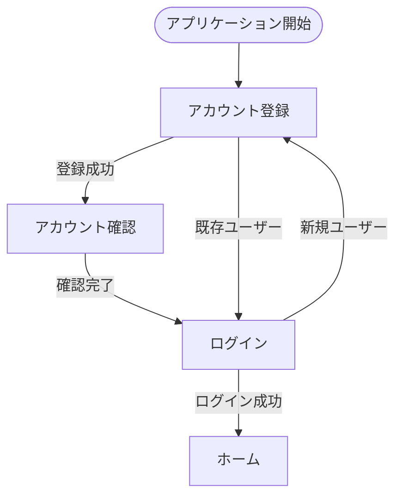
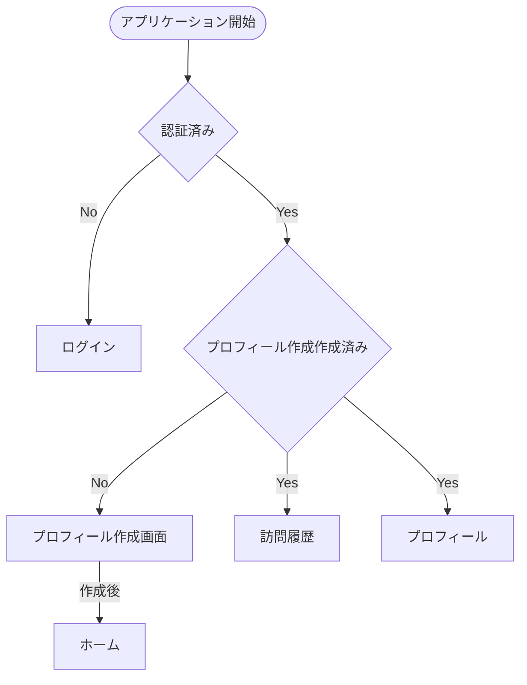

# My Beer Log - フロントエンド画面遷移設計書

## 概要

My Beer Log アプリケーションのフロントエンド画面遷移について、実装されたソースコードをベースに整理した設計書です。Next.js App Router を使用したクライアントサイドレンダリング（CSR）により構築されています。

## 画面一覧

### 認証系画面

| 画面名         | パス                   | コンポーネント      | 認証必要 | 説明                   |
| -------------- | ---------------------- | ------------------- | -------- | ---------------------- |
| ログイン       | `/auth/login`          | `LoginPage`         | ❌       | ユーザーのログイン     |
| アカウント登録 | `/auth/register`       | `RegisterPage`      | ❌       | 新規アカウント作成     |
| アカウント確認 | `/auth/confirm-signup` | `ConfirmSignupPage` | ❌       | Cognito 確認コード入力 |

### メイン画面

| 画面名 | パス | コンポーネント | 認証必要 | 説明                         |
| ------ | ---- | -------------- | -------- | ---------------------------- |
| ホーム | `/`  | `HomePage`     | ❌       | トップページ・ダッシュボード |

### 醸造所系画面

| 画面名     | パス              | コンポーネント        | 認証必要 | 説明                           |
| ---------- | ----------------- | --------------------- | -------- | ------------------------------ |
| 醸造所一覧 | `/brewery`        | `BreweryPage`         | ❌       | 全醸造所の検索・一覧表示       |
| 醸造所詳細 | `/brewery/[id]`   | `BreweryDetailPage`   | ❌       | 醸造所の詳細情報・チェックイン |
| 近隣醸造所 | `/brewery/nearby` | `NearbyBreweriesPage` | ❌       | GPS 位置情報による近隣検索     |

### ユーザー系画面

| 画面名       | パス       | コンポーネント | 認証必要 | 説明                       |
| ------------ | ---------- | -------------- | -------- | -------------------------- |
| 訪問履歴     | `/visits`  | `VisitsPage`   | ✅       | ユーザーのチェックイン履歴 |
| プロフィール | `/profile` | `ProfilePage`  | ✅       | ユーザー情報・統計・設定   |

### 共通画面

| 画面名           | パス | コンポーネント     | 認証必要 | 説明                         |
| ---------------- | ---- | ------------------ | -------- | ---------------------------- |
| 404 エラー       | `*`  | `not-found.tsx`    | ❌       | ページが見つからない         |
| グローバルエラー | `*`  | `global-error.tsx` | ❌       | アプリケーション全体のエラー |
| ローディング     | `*`  | `loading.tsx`      | ❌       | 各画面のローディング状態     |

## 画面遷移図

### 認証フロー



### 認証必要な画面



## 主要ユーザージャーニー

### 1. 新規ユーザー登録〜初回チェックイン

```
ホーム → アカウント登録 → アカウント確認 → ログイン → ホーム → 近隣醸造所検索 → 醸造所詳細 → チェックイン
```

### 2. 既存ユーザーのログイン〜醸造所探索

```
ホーム → ログイン → ホーム → 醸造所一覧 → 検索・フィルター → 醸造所詳細 → チェックイン
```

### 3. 訪問履歴の確認(認証済み)

```
ホーム → 訪問履歴 → フィルター・検索 → 醸造所詳細 → 再チェックイン
```

### 4. プロフィール管理(認証済み)

```
ホーム → プロフィール → 基本情報編集 → 統計確認 → 各種機能へのショートカット
```

## ナビゲーション設計

### Header (AppLayout)

- **表示**: 全画面共通
- **要素**: アプリ名、ナビゲーション、ユーザーメニュー
- **認証状態**: ログイン状態に応じたメニュー表示

### Navigation

- **ホーム**: 常に表示
- **醸造所**: 醸造所一覧・近隣検索へのリンク
- **認証状態別表示**:
  - 未認証: ログイン・登録ボタン
  - 認証済み: 訪問履歴・プロフィール・ログアウト

### Footer

- **表示**: 全画面共通
- **要素**: アプリ情報、利用規約、プライバシーポリシー等

## エラーハンドリング

### 認証エラー

- **401 Unauthorized**: ログイン画面へリダイレクト

### データエラー

- **404 Not Found**: 専用 404 画面表示
- **500 Server Error**: エラーバウンダリによるグローバルエラー処理

### 位置情報エラー

- **権限拒否**: エラーメッセージ表示、手動で醸造所検索を推奨
- **取得失敗**: リトライ機能、代替手段の提示

## ローディング状態

### 画面レベル

- 各ルートに専用の `loading.tsx` を配置
- Suspense 境界による段階的ローディング

### コンポーネントレベル

- API 通信中のスピナー表示
- ボタンの無効化・ローディングテキスト表示

## 外部連携・共有機能

### Web Share API

- 醸造所詳細の共有機能
- フォールバック: クリップボードコピー

### メール連携

- プロフィールからサポート連絡
- `mailto:` プロトコルによる外部メーラー起動
